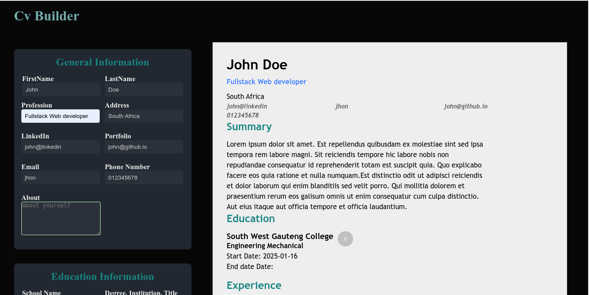

# Cv Builder

The CV-Builder is a user-friendly tool built with React that enables individuals to effortlessly create and customize their CV online. With features like input fields for general information, sections for work experience and education, and a real-time CV preview, users can easily tailor their CV to highlight their skills and achievements. Additionally, the application allows users to download their CV as a PDF, providing a convenient way to save and share their professional profile with potential employers.

# Live demo

The live demo for appliction is [here](cv-builder-five-taupe.vercel.app)

# Screenshot for Application

# Tech-stack

- React
- Css

# Approach

1. Create a new React project.
   Think about how to structure your application into components. Your application should include:

- A section to add general information like name, email and phone number.
- A section to add your educational experience (school name, title of study and date of study)
- A section to add practical experience (company name, position title, main responsibilities of your jobs, date from and until when you worked for that company)
